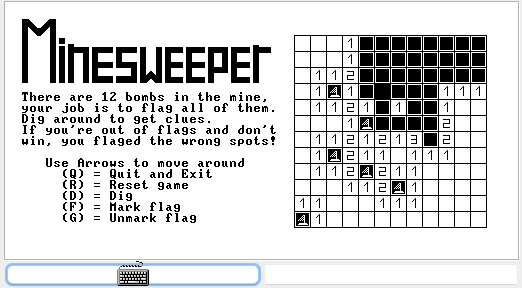

# Nand2Tetris
Our implementations of Nand2Tetris course by prof. Shimon Shoken.

## Course goal:
Implement the whole digital systems in the virtual computer. From Nand gate to a game.  
### Outcome:

## Projects:
1-3: Basic chips implementations

4: Basic programs written in Assembly

5: Memory and register chips

6: Assembler, written in Java (Assembly --> Hack (binary language))

7-8: VM Translator, written in Java (VM language --> Assembly)

9: Minesweeper game, written in Jack (high-level language)  
Screenshots of the game are inside the project folder.

10-11: Compiler, written in Python (Jack --> VM language)
